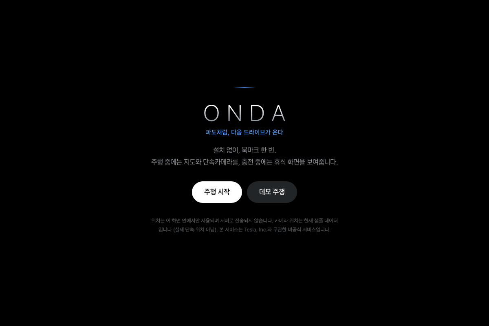

# Derrick Hwang

AI Product Builder turning observed friction into shipped products. I start with why, validate with evidence, then build the smallest useful system that can reach production.

**[View the live portfolio](https://kordp888.github.io/portfolio/)** · **[Open the Evidence Pack](./evidence/)** · **[Read the verification record](./VERIFICATION.md)** · **[Explore the product work](#product-portfolio)**

## Verification record

Entries past their review date stay as dated records until they are remeasured.

| Evidence | Result |
|---|---:|
| Release gate, scheduled pipelines | **37 of 225 attempts blocked before release, 16.4%, on 2026-09-02** |
| ONDA discovery research | **49 community posts analyzed** |
| ONDA delivery | **1 day from planning to production** |
| ONDA verification | **205 tests passed across 27 files on 2026-09-06** |
| LLM Wiki verification | **750 tests passed in a private verified environment on 2026-09-06** |
| WESOP archived QA | **58 unit and build checks, 278 public HTTPS browser checks, on 2026-09-09** |
| Franchise assistant persona UT | **30 → 41 of 44 correct, 7 → 9 of 12 held out, on 2026-09-29** |
| Career Coach persona UT | **25 synthetic personas, 7 defect types found, on 2026-09-29** |

These measure different systems and are never added together. Every figure, its scope,
and what it excludes live in [the evidence pack](./evidence/#숫자-한눈에), with the
registry in [claims.json](./evidence/claims.json). Figures I could not measure, such as
the gate false-positive rate, are recorded as not measured.

## Updates, 2026-09-29

Summarized from the engine commits; prompt text, rules, and source stay private.

- **AI Career Insight Coach** (3 commits): public web app moved to a local model on the operator's
  machine. Fixes from the synthetic persona UT block schema-example insight titles and literal
  line-break codes in code, stop adding outcomes or causal links the user never stated, suppress guidance text
  and stock closings in cover letters, and make follow-up questions quote the user's own facts.
- **Career Coach model**: gemma4:12b chosen on 2026-09-23 from five candidates on synthetic input
  (industry analysis 60s, dialogue turn 10s, draft 22s; others failed on format, register, steering,
  or time). Runs on Ollama with forced JSON, thinking off, temperature 0.3, 16,384-token context.
  Turns usually take 5 to 8 seconds, some 40 to 50 for an unconfirmed reason. No training; load and
  quality against an external API not measured.
- **Franchise Operations AI Assistant** (defect fixes, UT script, re-measurement on the deployment): six
  retrieval and intent defects fixed, each with a regression test that fails on the old code (85/85).
  Added the 5-persona, 44-question UT script.
- **Franchise assistant model**: six local setups (M1 Max 32GB, Ollama) and an external API were
  benchmarked over 51 runs against a bar set in advance: zero missing required facts, under 6 seconds.
  Best local was gemma4:12b with thinking off (6/30 adopted, 3 with missing facts, QA 27/51); the
  external API reached QA 23/51. Thinking mode did not help. Production uses rule sentences (QA 51/51).

## Product portfolio

### LLM Content Operations

A private production workflow connects market data, scripts, voice, video, review, and publishing across four channels. As of 2026-09-06, the upload path used seven representative verification categories. Source inconsistencies and safety violations stop release. The operating record contains **319 cumulative publications as of 2026-09-01**.

[Inspect the synthetic release-gate evidence](./evidence/content_automation/)
· Release-gate module: private, shown on request

### WESOP · ShopSol FLEX

An educational prototype for shift staffing. A gap moves from detection to candidate comparison,
offer, simulated acceptance, readiness check, and manager confirmation. Offering or accepting alone
does not fill the shift, so the record holds only what a manager actually confirmed. Archived QA on
2026-09-09 records **58 unit and build checks and 278 public HTTPS browser checks**. No real
participants and no physical device testing.

[Open the prototype](https://wesop-shopsol-prototype.vercel.app/)

### ONDA

A no-install driving home for the Tesla in-car browser. The product moved from **49 analyzed community posts** to a working deployment in **1 day**. As of 2026-09-06, the latest release candidate passed **205 tests across 27 files** and was blocked pending commercial voice-rights evidence.

  

[View the ONDA showcase](https://github.com/kordp888/ONDA-for-Tesla-showcase)
· [Inspect the GPS fallback evidence](./evidence/onda/)

### LLM Wiki

A locally operated knowledge system using sLLMs, agents, deterministic checks, and human approval gates. Daily check-ins and the runtime guard are active; news collection and automatic publication are paused. The private implementation passed **750 tests** on 2026-09-06. This public repository contains architecture documentation rather than the implementation or test suite.

[Read the architecture](https://github.com/kordp888/llm-wiki)
· [Inspect the additive-only sync evidence](./evidence/llm_wiki/)

### 다시ON5060

A voice-first AI accessibility product for older Korean adults. It guides the user through the next useful action in plain language.

[Explore 다시ON5060](https://github.com/kordp888/dasi-on5060)

### Signal Crew

An AI-native SaaS product that unifies work, collaboration, and finance in one operating surface.

[Explore Signal Crew](https://github.com/kordp888/signal-crew)

### AI Career Insight Coach

An AI career coach that helps candidates find job-relevant insight in their own experience instead of
generating generic application documents. The flow moves from industry, company, and job analysis to
experience reflection, and only then into resume, cover letter, portfolio, and interview material.
The public repository holds the product overview, open templates, and a fictional candidate example.

Since 2026-09-29 the production web app runs AI analysis on a local model (gemma4:12b) on the
operator's Mac Studio M1 Max 32GB, and does not send it to an external AI service. Input still passes
through the web app server and an encrypted connection to reach that machine, and AI analysis stops
when the machine is off. The same day, **25 synthetic personas** were run end to end through dialogue,
insight, and cover letter. Reading the output by hand found **7 defect types** the automated checks
missed; prompts and rules were adjusted, with no model training. Re-verification covered 4 personas
in 6 runs, not all 25, and no real users were involved.

[Open the app](https://career-insight-coach.vercel.app)
· [Explore AI Career Insight Coach](https://github.com/kordp888/career-insight-coach)

### Franchise Operations AI Assistant

An assistant beside the admin screen of a franchise operations SaaS. Managers ask about manuals,
reviews, and hygiene inspections from the screen they are on, then edit and approve notice drafts.
A deterministic rule engine decides intent, tools, and approval; the LLM is an optional summary layer
whose sentences are discarded if they contain numbers, stores, or dates not in the data. Six local
model setups and an external API were benchmarked over 51 runs, none met the bar of zero missing
facts within 6 seconds, so production runs on rules. On 2026-09-29, five synthetic store-owner personas
asked 44 scripted questions: correct answers rose from **30 to 41**, and from 7 to 9 on the 12 questions
not used for fixing. Synthetic and dummy data only, zero real users. The client and brand are not named.

[Read the case study and screens](./projects/franchise-agent/)

### 세이프체크

A messenger security comparison service developed by a five-person team. User tests showed that
the first screen was being mistaken for antivirus software, so the flow was redesigned around
that finding and iterated from v5 to v7. Team artifacts and interview transcripts remain private.

### 린온

A five-person hackathon product where children practice speaking with characters from Korean folk
tales. Generated lines pass an age-focused vocabulary gate, while a three-stage fallback keeps the
activity moving when speech or model calls fail. The implementation remains private.

[Try 린온](https://lean-on-goodquestion.vercel.app)

## Tools

- LLM Quality Gates: release-gate module extracted from the content pipeline, 78 passing tests and one optional integration test skipped. Kept private; walkthrough available on request.
- [career-docs](https://github.com/kordp888/career-docs-skill): a Claude Code skill for job application documents. Pins dates and metrics to one source file, checks writing for machine-like patterns, exports print quality PDFs from HTML and PPTX, and strips generator metadata. The writing checker runs standalone.

## How I work

- Observe real friction before defining the product.
- Turn evidence into a narrow, testable product decision.
- Ship to production and measure what actually happens.
- Convert repeatable operations into reusable systems.

## Links

[Live portfolio](https://kordp888.github.io/portfolio/) · [GitHub](https://github.com/kordp888)
