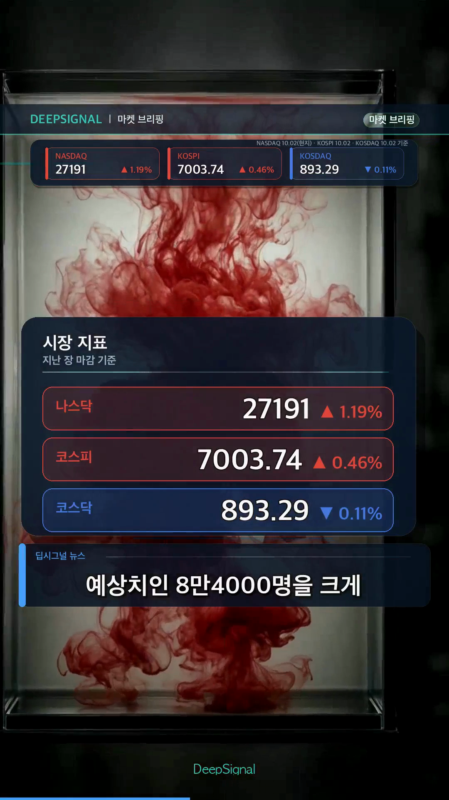

# 유튜브 다중채널 제작·검증 자동화

2026.06부터 개인으로 구현·운영했습니다. 반복되는 제작 작업을 연결하면서 생성 결과를 원본과 대조하고 사람이 공개 여부를 판단할 수 있게 하는 것이 과제였습니다.

## 요구사항과 선택

자료 수집부터 음성·영상까지 이어지는 작업에서 각 결과의 원본과 실행 상태를 추적할 수 있어야 했습니다. Python으로 LLM 초안·외부 음성·영상 도구와 업로드 API를 연결했습니다. 출력은 검토할 영상과 설명이며 비공개 업로드 뒤 공개 발행은 사람이 결정합니다.

## 실패 처리와 결과

실패한 결과는 보류하고 원본과 대조해 해당 부분을 수정합니다. 2026.09.09 정리한 과거 운영 집계에서 정시 파이프라인의 업로드 게이트 도달 225건 중 37건이 차단됐습니다. 앞 단계에서 중단된 시도는 분모에 포함하지 않습니다. 이번 제작에서 원시 로그는 재집계하지 않았습니다. 측정 기간은 미확인이고 정확도·오류 탐지율·효율 개선률을 뜻하지 않습니다.

2026.10.05 보존된 검토용 영상의 실제 프레임입니다. 공개 발행 증빙은 아닙니다. 운영 로그, 내부 검수 순서·판정 규칙·프롬프트는 공개하지 않습니다.

[포트폴리오](https://kordp888.github.io/portfolio/#content-automation)
