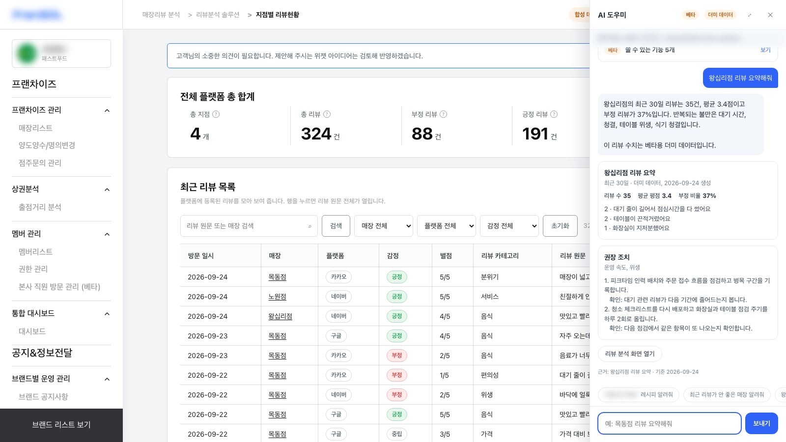
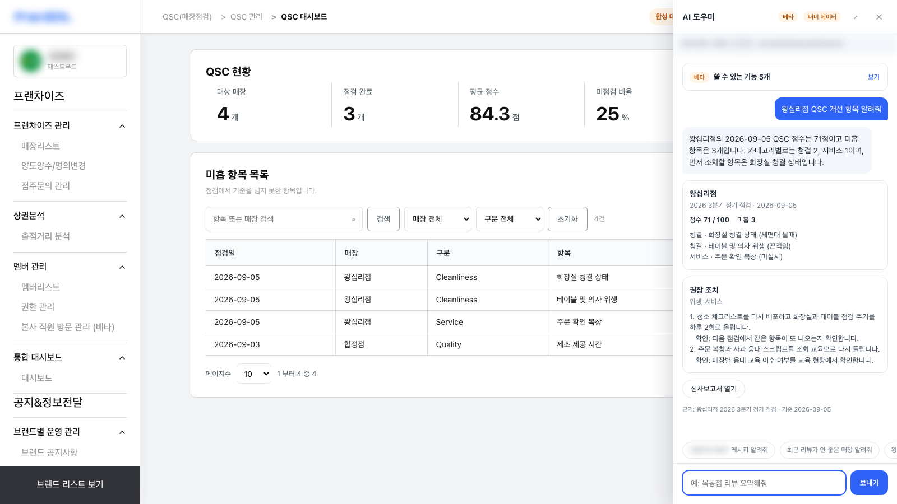
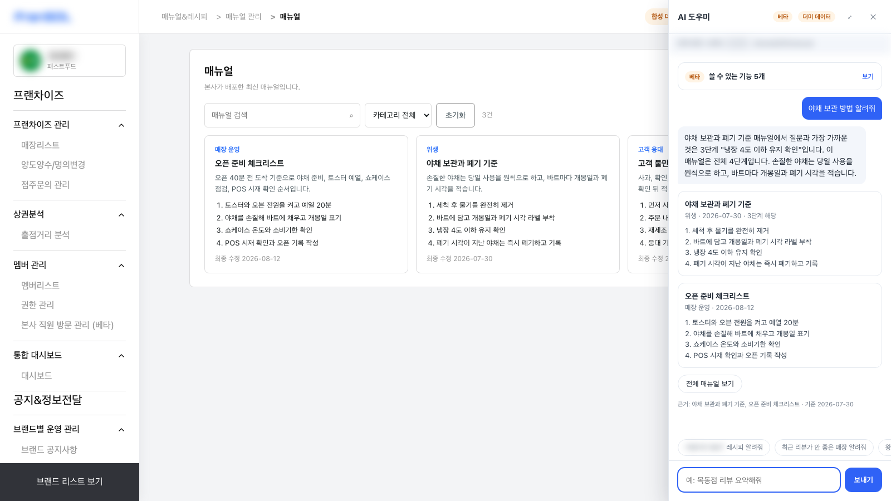
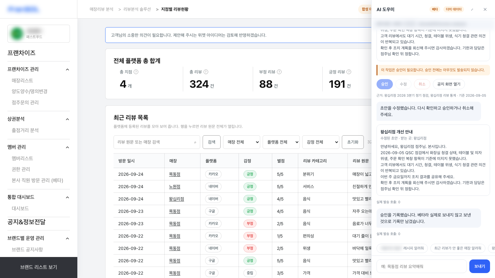
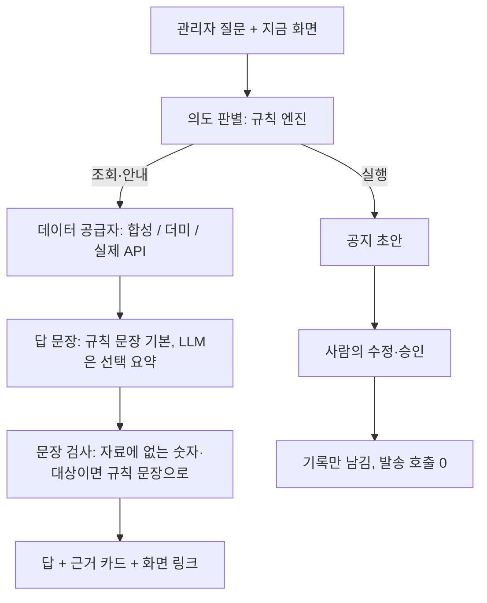

# 프랜차이즈 운영 AI 업무 도우미 (MVP)

프랜차이즈 운영 SaaS의 관리자 화면 옆에 붙어, 관리자가 묻고 근거를 확인한 뒤 다음 업무로 넘어가도록 돕는 AI 도우미입니다. 답의 숫자는 데이터에서만 나오고, 실행형 기능은 사람이 승인하기 전까지 멈춥니다.

- 기간: 2026년 9월, 1인 프로젝트(기획, 설계, 구현, 검증)
- 대상: 가맹본부 운영 관리자. 매뉴얼·레시피는 점주와 직원도 사용
- 상태: 웹 MVP 운영, 합성·더미 데이터로 시연. 실제 발송은 꺼져 있음
- 고객사와 브랜드 이름은 공개하지 않습니다. 캡처의 로고, 브랜드, 계정, 메뉴명은 흐림 처리했습니다

## 무엇을 하나

| 기능 | 돌려주는 것 |
| --- | --- |
| 매뉴얼·레시피 안내 | 질문과 가장 가까운 단계, 전체 단계 수, 해당 화면 링크 |
| 리뷰 요약 | 기간, 건수, 평균, 부정 비율, 반복 불만, 확인이 필요한 매장 |
| 위생 점검(QSC) 정보 | 점수, 분류별 미흡 항목, 먼저 조치할 항목 |
| 화면 안내·이동 | 지금 보는 화면의 설명과 관련 업무 화면 링크 |
| 공지 초안 | 점검·리뷰 근거를 담은 초안 |
| 초안 수정·승인 | 사람이 고치고 승인하면 기록만 남김(발송 호출 0) |

## 화면

| | |
| --- | --- |
|  |  |
| 리뷰 화면에서 매장 리뷰 요약. 수치 끝에 더미 데이터 표시가 붙습니다 | 점검 결과와 먼저 조치할 항목 |
|  |  |
| 질문과 가장 가까운 매뉴얼 단계를 인용 | 초안 수정 뒤 승인. 실제 발송 호출은 0 |

## 설계 원칙

1. **숫자는 자료에서만.** 답에 들어가는 수치, 매장, 날짜는 데이터 공급자가 준 자료에 있는 것만 씁니다.
2. **실행은 사람이.** 공지처럼 밖으로 나가는 일은 초안까지만 만들고, "승인 없이 보내"라고 해도 승인 단계로 돌아갑니다.
3. **없으면 없다고.** 등록되지 않은 문서를 물으면 비슷한 문서를 내밀지 않고, 없다고 답한 뒤 있는 목록을 보여 줍니다.
4. **화면 맥락을 읽음.** 관리자가 지금 보는 브랜드, 매장, 화면 경로를 함께 받아 질문을 해석합니다.

## 구조

데이터 공급자와 LLM 공급자는 각각 인터페이스 하나 뒤에 있어 환경 설정으로 바꿉니다. 실제 API가 연결되면 데이터 공급자만 교체하고 화면과 대화 방식은 그대로입니다.

## R&D 설계

**질문.** 운영 도우미의 답을 LLM이 직접 쓰게 할지, 규칙 엔진이 쓰고 LLM은 다듬기만 하게 할지를 먼저 정해야 했습니다. 운영 데이터를 다루는 답에서 가장 비싼 실수는 틀린 숫자이기 때문입니다.

**설계.** 의도 판별, 도구 선택, 승인 여부는 결정적인 규칙 엔진이 정합니다. LLM은 켜져 있을 때만 요약 문장을 쓰고, 그 문장은 검사 층을 통과해야 채택됩니다. 검사 층은 자료에 없는 숫자, 매장, 날짜, 링크, 또는 "발송했다" 같은 실행 주장이 있으면 문장을 버리고 규칙 문장으로 되돌립니다. 모델에는 사용자 원문 대신 정규화된 요청과 엔진이 고른 자료만 보내, 외부로 나가는 입력을 약 500자로 고정했습니다.

**평가 방법.** 합성 데이터로 17문항×3회(51회)를 돌리고, 모델 경로를 타는 30회에서 모델 문장이 몇 번 채택되는지, 전체 QA가 몇 번 통과하는지, 지연 시간, 안전 지표 6종(프롬프트 추출, 자동 발송 등)을 쟀습니다. 채택 기준은 요약의 사실 누락 0, 모델 경로 6초 이내입니다. 문장 품질은 블라인드 비교로 따로 봤습니다.

## 모델 테스트

**공급자 비교**

| 방식 | QA 통과 | 모델 문장 채택 | 모델 경로 지연(중앙) | 품질(자연스러움·명확함·실행 가능성, 5점) |
| --- | --- | --- | --- | --- |
| 규칙 문장 | 51/51 | 해당 없음 | 0.002초 | 4.22 · 4.44 · 3.44 |
| 로컬 7B 모델 | 21/51 | 0/30 | 2.49초 | 표본 부족 |
| 외부 API | 23/51 | 2/30 | 3.22초 | 3.83 · 4.50 · 4.17 |

세 방식 모두 안전 지표 6종이 0이었고, 외부로 나간 요청은 766자, 내부 프롬프트는 0줄이었습니다.

**로컬 모델 비교 (M1 Max 32GB, Ollama, 6초 제한)**

| 엔진 | 초당 토큰 | 모델 문장 채택 | 모델 경로 지연(중앙) | QA 통과 |
| --- | --- | --- | --- | --- |
| gemma4:12b 생각 끔 | 24.1 | 6/30(3건 사실 누락) | 4.02초 | 27/51 |
| exaone3.5:7.8b | 40.6 | 1/30(1건 누락) | 2.72초 | 22/51 |
| A.X-4.0-Light Q4 | 42.6 | 0/30 | 1.66초 | 21/51 |
| qwen3.5:9b 생각 끔 | 35.6 | 0/30 | 2.69초 | 21/51 |
| qwen3.5:9b 생각 켬 | 35.7 | 0/30(빈 답 24) | 5.74초 | 21/51 |
| gemma4:12b 생각 켬 | 23.9 | 0/30 | 6초 초과 | 21/51 |

**결론.** 채택 기준을 넘은 모델이 없어 배포본은 규칙 엔진으로 운영하고, 외부 API는 보조 후보로만 둡니다. 블라인드 비교(판정자 3명, 6쌍)에서도 규칙 문장이 명확함 4.33 대 3.17, 실행 가능성 4.00 대 2.83으로 로컬 모델보다 높았습니다. "생각" 모드는 이 과업에서 지연만 늘리고 채택률을 올리지 못했습니다. 모델 가중치 학습은 하지 않았습니다.

## 페르소나 UT

가상 점주 페르소나 5명(신규, 다점포, 고령, 야간, 외국인)의 말투로 쓴 질문 44개를 스크립트로 넣고 자동 판정했습니다. 리뷰 수치는 도우미 답이 아니라 원본 데이터에서 따로 계산해 대조했습니다.

| 묶음 | 문항 | 수정 전 | 수정 후 |
| --- | --- | --- | --- |
| 과업 | 20 | 17 | 20 |
| 확인용 | 12 | 6 | 12 |
| 수정에 쓰지 않은 질문 | 12 | 7 | 9 |
| 합계 | 44 | 30 | 41 |

- 비슷하지만 틀린 문서를 내준 답: 5건에서 2건으로
- 리뷰 수치 일치 8/8, 초안·승인·발송 구분 2/2는 수정 전후 모두 유지
- 검색·의도 판별 결함 6종을 고치고, 수정 전 코드에서 실패하는 회귀 테스트를 각각 붙임(단위 테스트 85/85)
- 배운 점: 없다고 말하는 답보다 비슷한 문서를 자신 있게 내미는 답이 더 위험했습니다. 그래서 수정 기준을 "없으면 없다고 말하기"로 잡았습니다

## 측정하지 않은 것

실사용자 검증, 실기기 전수 시험, 실제 데이터에서의 정확도, 업무 효과(시간 절감, 만족도), 부하, 접근성. 페르소나 질문은 개발자가 직접 작성했고, 남은 결함 3건과 역할별 권한 미구현이 있습니다.

## 기술

Next.js 16, React 19, TypeScript, Vercel 서버리스, Node 테스트 러너(tsx), Playwright(모바일 WebKit QA, 페르소나 UT 녹화), Ollama(로컬 모델 벤치), Capacitor(iOS 셸).
